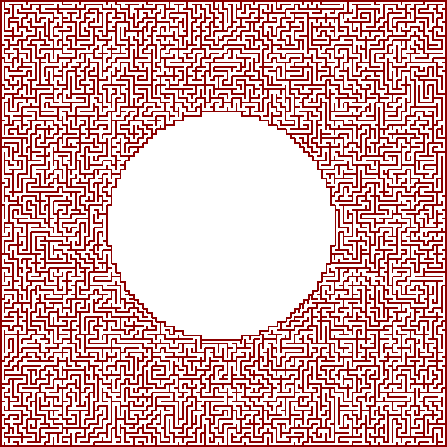

# Mazes for Programmers - Ruby Implementations

This repository contains Ruby implementations of maze algorithms, copied or based upon those in the EXCELLENT book "Mazes for Programmers"

<https://pragprog.com/book/jbmaze/mazes-for-programmers> 

## Installing and Running Stuff

This is a personal project so work it out yourself! 

My top tip...

**Use VS Code, and use the Dev Container that is defined in this repository**. If you do that you'll be set up with a fully functioning Ruby development environment without having to set it up manually! Want to know more...?

<https://code.visualstudio.com/docs/remote/containers>

You will need to run `bundle install` the first time you open the project to install the gemfiles that are requried.

I've created a number of Rake tasks to make it easy for me to run the demos. At the time of writing, these are the defined rake tasks...

``` bash
rake algorithms:aldous_broder           # Algorithm demo: Aldous Broder
rake algorithms:aldous_broder_coloured  # Algorithm demo: Aldous Broder, with colour
rake algorithms:binary_tree             # Algorithm demo: Binary Tree
rake algorithms:binary_tree_colour      # Algorithm demo: Binary Tree, with colour
rake algorithms:hunt_and_kill           # Algorithm demo: Hunt and Kill
rake algorithms:recursive_backtracker   # Algorithm demo: Recursize Backtracker
rake algorithms:sidewinder              # Algorithm demo: Sidewinder
rake algorithms:sidewinder_colour       # Algorithm demo: Sidewinder, with colour
rake algorithms:wilsons                 # Algorithm demo: Wilsons
rake default                            # Run most of the demos
rake distances:dead_ends                # Counts the dead ends maze generated with a selection of algoritms
rake distances:dikstra                  # Distances: Distra's algorithm
rake distances:longest_path             # Shows the longest path in a maze
rake masks:ascii_mask                   # Generates a maze using an ASCII mask
rake masks:image_mask                   # Generates a maze using an image mask
rake masks:simple_mask                  # Demonstrates a simple ASCII mask
rake polar:test                         # Polar Grid Test
```

The list the rake tasks run `rake -T -A` from the terminal. 

Each of the algorithms has a demo script. Assuming you have your Ruby environment set up you should be able to run something like...

```bash
ruby demos/recursive_backtracker_demo.rb
```

... and this will either generate files in the `output` directory, or will write output directly to the terminal

## Some Example Output

### A Coloured Polor Grid 
In this example, colour is used to show the distance from the centre cell.


### Sidewinder Image Maze
This maze was generated using the sidewinder algorithm.


### Sizewinder ASCII Maze
This is an ASCII representation of the above maze.


``` text
+---+---+---+---+---+---+---+---+---+---+---+---+---+---+---+
|                                                           |
+   +---+   +---+---+   +   +---+   +   +---+---+   +---+   +
|       |   |           |       |   |           |   |       |
+   +   +---+   +   +---+---+   +---+---+   +   +   +   +   +
|   |   |       |           |       |       |   |   |   |   |
+---+---+   +---+   +---+---+---+---+---+---+---+   +---+---+
|               |   |                                       |
+   +   +---+   +   +---+   +   +---+   +---+---+---+   +   +
|   |       |   |   |       |       |               |   |   |
+   +   +---+   +   +---+---+---+---+   +   +   +---+---+   +
|   |       |   |   |                   |   |   |           |
+   +   +---+---+   +---+---+   +---+   +   +---+---+   +   +
|   |           |           |       |   |   |           |   |
+   +---+   +   +   +   +---+---+   +---+---+---+   +---+   +
|       |   |   |   |   |                   |       |       |
+   +   +   +   +---+---+   +---+   +---+   +---+---+   +   +
|   |   |   |   |               |   |       |           |   |
+   +   +   +   +---+   +---+   +   +---+   +   +   +---+   +
|   |   |   |       |       |   |       |   |   |   |       |
+   +   +   +---+   +---+---+   +   +---+   +   +---+---+---+
|   |   |   |               |   |       |   |               |
+   +   +   +   +   +---+---+---+   +---+   +---+---+---+   +
|   |   |   |   |               |   |               |       |
+   +   +   +---+   +---+   +---+   +   +   +   +---+---+   +
|   |   |   |           |   |       |   |   |       |       |
+   +---+---+---+   +   +   +   +   +---+   +   +   +   +---+
|               |   |   |   |   |       |   |   |   |       |
+   +   +   +---+---+---+   +---+---+---+---+   +---+---+---+
|   |   |               |               |                   |
+---+---+---+---+---+---+---+---+---+---+---+---+---+---+---+

```
### Recursive Backtracker Image Maze
Again, colour represents distance from the central cell.


### Recursive Backtracker Maze with Image Mask
A bitmap mask has been used to constrain this maze.


 